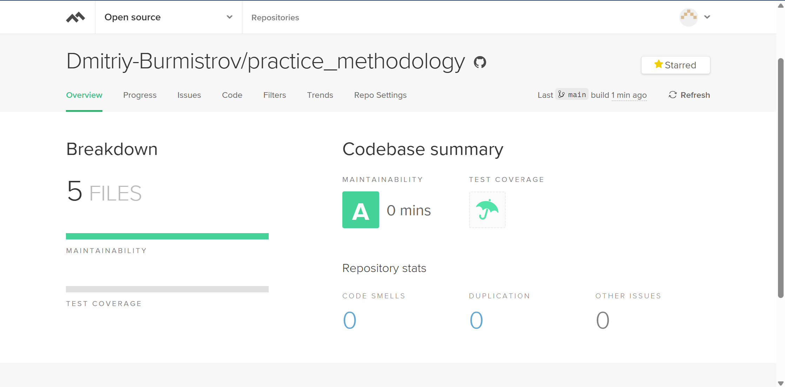

# Лабораторная №1 по дисциплине "Методология разработки ПО"

*Выполнил:* Бурмистров Дмитрий

*Группа:* БИВТ-22-СП-4

*Язык программирования:* JavaScript,

*Линтер*: ESLint

**Значок maintability:**

---

## Игра "НОК" (Наименьшее общее кратное)

---

## Игра "Геометрическая прогрессия"

